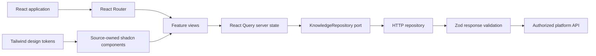

# Phase 5: React Frontend

## Scope

Phase 5 implements the production frontend foundation and four business views:

- organizational intelligence dashboard;
- grounded knowledge search;
- project details; and
- evidence-backed Project DNA.

It deliberately excludes authentication, authorization administration, document
upload, proposal generation, one-pager generation, knowledge capture, expert profiles,
notifications, and agent workflow interfaces. Those features require later approved
phases.

## Architecture



### Application composition

`src/app` composes the router, Query Client, and repository provider. The repository is
injected into the application, which keeps network behavior replaceable and makes
feature tests deterministic. Route-level errors are separated from server-state errors.

### Feature slices

`features/dashboard` owns the knowledge overview, server-backed metrics, recent
projects, coverage, and industry distribution. It renders explicit loading, empty, and
unavailable states.

`features/search` treats the URL query string as durable search state. It renders
Phase 4 answer claims individually, links each claim to validated citations, displays
the three confidence components, supports explicit abstention, and labels confidence
as evidence strength rather than probability.

`features/projects` owns reusable project cards, project navigation, the overview, and
Project DNA. DNA claims preserve confidence and expandable source evidence. Missing
claims remain visibly unavailable; the UI does not infer replacements.

### API boundary

`lib/api/knowledge-repository.ts` is the frontend port. The HTTP adapter:

- sends same-origin credentials;
- creates a request correlation identifier;
- passes `AbortSignal` cancellation from React Query;
- URL-encodes resource identifiers;
- maps problem details to a stable `ApiError`; and
- validates successful JSON with Zod before data reaches a component.

The required Phase 5 presentation endpoints are:

| Method | Path | Purpose |
|---|---|---|
| `GET` | `/api/v1/dashboard` | Dashboard aggregates and recent projects |
| `POST` | `/api/v1/questions` | Phase 4 grounded answer plus related projects |
| `GET` | `/api/v1/projects/{projectId}` | Project detail presentation model |
| `GET` | `/api/v1/projects/{projectId}/dna` | Evidence-backed Project DNA |

These endpoints are intentionally not added to the Phase 4 backend without a trusted
identity and authorization source. The frontend contains no runtime demo adapter. Until
the protected read endpoints exist, it fails visibly and safely instead of displaying
fabricated organizational knowledge.

## Design system

The UI uses Tailwind CSS 4 and source-owned shadcn-style primitives. The palette uses a
deep navy workspace navigation, warm neutral content canvas, cobalt actions, and teal
evidence accents. Typography, spacing, radii, borders, shadows, and semantic colors are
centralized in `styles.css`.

The system supports keyboard focus, semantic landmarks, visible labels, reduced motion,
responsive grids, mobile navigation, native disclosure controls for evidence, and
screen-reader loading status. Icons are decorative unless they carry an explicit label.

No external font, tracking script, remote image, or client-side secret is loaded.

## Folder structure

```text
apps/web/
├── docs/                       # Phase-specific architecture and operating decisions
├── public/                     # Static public assets (currently intentionally empty)
├── src/
│   ├── app/                    # Composition root, providers, router, route errors
│   ├── components/
│   │   ├── layout/             # Application shell, navigation, headers, brand
│   │   └── ui/                 # Source-owned shadcn design primitives
│   ├── features/
│   │   ├── dashboard/          # Organizational overview
│   │   ├── projects/           # Project details and Project DNA
│   │   └── search/             # Grounded search experience
│   ├── lib/
│   │   └── api/                # Ports, DTO schemas, HTTP adapter, query options
│   ├── test/                   # Test-only fixtures, render harness, setup
│   ├── main.tsx                # Browser entry point
│   └── styles.css              # Tailwind import and product design tokens
├── components.json             # shadcn component ownership configuration
├── package-lock.json           # Reproducible dependency graph
├── package.json                # Commands, runtime, and tooling dependencies
├── tsconfig*.json              # Strict browser and build typing
├── vite.config.ts              # Build, aliases, Tailwind, local proxy
└── vitest.config.ts            # DOM tests and enforced coverage thresholds
```

## Engineering standards

- TypeScript strict mode, isolated modules, unused-symbol and fallthrough checks.
- ESLint strict type-aware and stylistic rules, React Hooks rules, React Query rules,
  Testing Library rules, and zero warnings.
- Server state is never copied into component state.
- URL state is used for shareable searches and project navigation.
- API data has compile-time types and runtime schemas.
- Components are small, semantic, and organized by feature ownership.
- Tests query accessible roles and user-visible content rather than implementation details.
- The production build targets ES2022 and emits source maps for controlled error tracking.

## Configuration

- `VITE_API_BASE_URL`: same-origin API prefix; defaults to `/api/v1`.
- `VITE_API_PROXY_TARGET`: local Vite proxy target only.

Only variables prefixed with `VITE_` enter the browser bundle. Secrets must never use
that prefix or be stored in frontend environment files.

## Testing

The test suite covers:

- HTTP security defaults, correlation IDs, problem responses, malformed contracts, and
  safe non-JSON failures;
- dashboard loading completion, metrics, recent projects, empty data, errors, retry, and
  search submission;
- grounded claims, citation navigation, evidence strength, suggested and typed queries,
  abstention, errors, and retry;
- complete and sparse project profiles, outcomes, documents, technologies, capabilities,
  experts, and unavailable states; and
- complete, sparse, and unavailable Project DNA with evidence disclosures.

Fixtures live only under `src/test`; they are not imported by the production entry point.

## Acceptance criteria

- All four requested views are responsive and navigable.
- Dashboard values come only from the API.
- Search answers display claim-level citation identifiers and inspectable source quotes.
- Abstentions never render an answer or related evidence as fact.
- Project details preserve unavailable states for absent grounded fields.
- Every Project DNA claim exposes confidence and source evidence.
- Every API response is runtime-validated.
- Loading, empty, error, and success states are implemented.
- The application is keyboard-operable and honors reduced-motion preferences.
- Type checking, linting, tests, coverage thresholds, and production build pass.

## Local production build

`npm run build` produces static assets in `dist/`. They can be previewed locally with
`npm run preview`. A hosting architecture, route fallback policy, security headers,
compression, and cache policy will be selected only when deployment is in scope.

## Future considerations

- Complete SSO and project ACL enforcement before enabling read endpoints.
- Generate a versioned OpenAPI client after presentation endpoints stabilize.
- Add route-level lazy loading when the feature bundle grows enough to justify it.
- Add automated accessibility testing and browser-level Playwright journeys in CI.
- Add CSP nonces, frontend observability, privacy-safe product analytics, and Web Vitals.
- Add upload, knowledge capture, proposal, one-pager, and agent workflow interfaces only
  in their approved phases.
