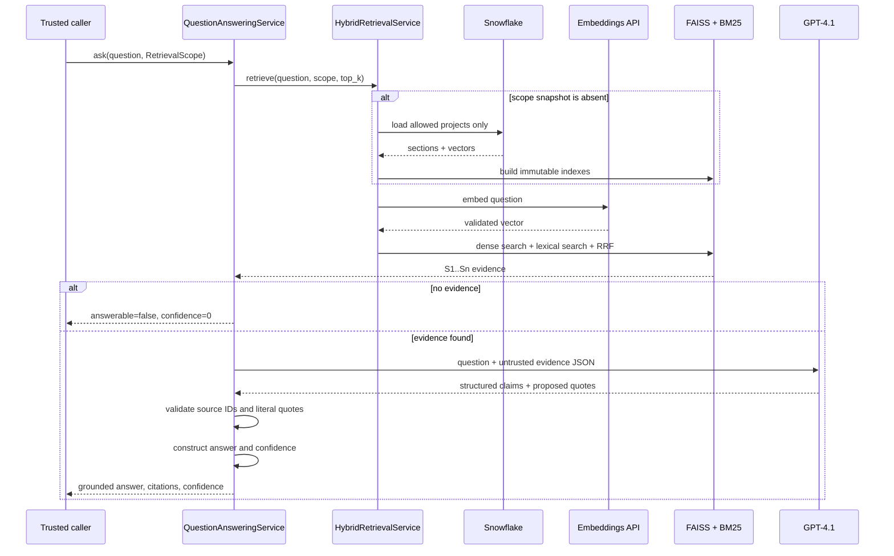

# Phase 4: Hybrid Retrieval and Grounded Question Answering

## Scope

Phase 4 implements the backend application capability for:

- project-authorized hybrid retrieval;
- FAISS dense cosine search;
- BM25 lexical search;
- weighted reciprocal-rank fusion (RRF);
- GPT-4.1 structured question answering;
- application-validated citations; and
- a transparent heuristic confidence score.

This phase intentionally does not add a public HTTP endpoint, conversational memory,
reranking, agent orchestration, frontend UI, or index administration. An API endpoint
must not be exposed until authentication and project authorization can derive the
mandatory `RetrievalScope` from trusted identity claims.

No Snowflake migration is required. Phase 4 reads the Phase 3 `DOCUMENTS`,
`DOCUMENT_SECTIONS`, and `EMBEDDINGS` tables. Snowflake remains the durable source of
truth; FAISS and BM25 are replaceable in-memory projections.

## Architecture

```mermaid
flowchart LR
    Caller[Authorized application caller] -->|question + allowed project IDs| QA[QuestionAnsweringService]
    QA --> R[HybridRetrievalService]
    R -->|scoped SQL| SF[(Snowflake)]
    SF --> Snapshot[Immutable scoped corpus snapshot]
    Snapshot --> Dense[FAISS IndexFlatIP]
    Snapshot --> Lexical[BM25 index]
    R -->|question| Emb[OpenAI embedding adapter]
    Emb --> Dense
    Dense --> RRF[Weighted RRF]
    Lexical --> RRF
    RRF -->|top evidence with S1..Sn IDs| GPT[GPT-4.1 Structured Outputs]
    GPT -->|claims + proposed exact quotes| Validator[Application grounding validator]
    Validator --> Confidence[Deterministic confidence calculator]
    Confidence --> Result[GroundedAnswer]
```

### Domain

`knowledge_retrieval/domain` owns immutable models and stable failures. A
`RetrievalScope` requires at least one normalized project ID; there is no unscoped
search state. `IndexedSection` carries the source locator and vector. `GroundedAnswer`
separates claims, citations, abstention reason, and confidence so presentation layers
do not need to parse model prose.

### Application

`HybridRetrievalService` validates questions, lazily creates immutable indexes, and
caches them by a SHA-256 fingerprint of the exact project allowlist. The bounded LRU
cache prevents indefinite memory growth. `refresh` atomically replaces a snapshot and
`invalidate` supports future enrichment-completion events.

`QuestionAnsweringService` coordinates retrieval and generation. It rejects every
answerable response without claims, every claim without citations, unknown source IDs,
and every quote that is not a literal substring of its cited persisted section. The
application constructs the final answer by joining validated claim text; the model has
no separate uncited answer channel.

Ports isolate Snowflake, OpenAI, and FAISS from application policy. Import contracts
enforce domain and application independence.

### Infrastructure

`SnowflakeRetrievalCorpusRepository` issues a parameter-bound query whose project
allowlist is applied before rows leave Snowflake. It joins section embeddings by
document and section sequence, requires `target_type = 'document_section'`, checks the
configured dimensions, and maps page, slide, and heading locators.

`FaissHybridSearchIndex` normalizes corpus and query vectors, then uses
`IndexFlatIP` for exact cosine similarity. Exact search is the correct maintainable
baseline while corpus size and latency data are unknown. BM25 provides exact-term,
acronym, client-name, and technology-name recall. Weighted RRF combines ranks instead
of incorrectly comparing cosine and BM25 raw scores. Default weights are 0.6 dense and
0.4 lexical with `k=60`.

`OpenAIQueryEmbeddingGateway` uses the same `text-embedding-3-large` model and 3,072
dimensions as Phase 3. It validates token limits, result count, dimensions, finite
values, and non-zero vectors.

`OpenAIAnswerGenerator` uses the pinned `gpt-4.1-2025-04-14` model and the Responses
API Structured Outputs integration. Retrieved content is serialized as explicitly
untrusted JSON. The model may emit only an answerable flag, cited claims, and an
optional abstention reason. This follows OpenAI's
[Structured Outputs](https://developers.openai.com/api/docs/guides/structured-outputs)
and [embeddings](https://developers.openai.com/api/docs/guides/embeddings) interfaces.

## Request sequence

## Confidence score

Confidence is an application-owned heuristic, not a probability and not a model
self-rating. The response includes its normalized components:

- retrieval strength: top-result cosine mapped to `[0,1]` and BM25 saturation;
- citation coverage: all returned claims have validated citations; and
- source diversity: cited-document coverage, capped at two documents.

The current score is `0.55 * retrieval + 0.30 * coverage + 0.15 * diversity`, capped at
`0.95`. Bands are high at `>=0.80`, medium at `>=0.55`, and low otherwise. An abstention
always scores zero. These thresholds must be calibrated against a labeled Blend query
evaluation set before user-facing claims such as “95% certain” are permitted.

## Configuration

All settings use the `BLEND_BRAIN_` prefix:

- `OPENAI_QUESTION_ANSWER_MODEL`
- `RETRIEVAL_DEFAULT_TOP_K`
- `RETRIEVAL_RRF_K`
- `RETRIEVAL_DENSE_WEIGHT`
- `RETRIEVAL_LEXICAL_WEIGHT`
- `RETRIEVAL_CANDIDATE_MULTIPLIER`
- `RETRIEVAL_MAX_CACHED_SCOPES`
- `RETRIEVAL_MAX_QUESTION_CHARACTERS`
- `RETRIEVAL_ANSWER_MAX_INPUT_TOKENS`

Existing OpenAI embedding, timeout, retry, and Snowflake settings are reused. For local
use, secrets belong only in the ignored `.env` file and must never be committed.

## Failure handling and security

- Empty scopes and questions fail before external calls.
- Snowflake and OpenAI failures become stable domain errors without leaking credentials.
- Indexes contain only already-authorized projects; results are not filtered after search.
- Prompt-injection instructions in retrieved content are marked untrusted in both prompt
  layers and cannot bypass deterministic citation checks.
- Invalid vectors, corrupt row shapes, unknown source IDs, invented quotes, and uncited
  claims fail closed.
- Insufficient retrieval evidence returns an explicit abstention and avoids the answer
  model call.

## Testing

Tests cover scope invariants, dense/lexical fusion, semantic-miss recovery, invalid and
zero vectors, LRU isolation, refresh/invalidation, abstention, literal citation
grounding, confidence calculation, Structured Outputs usage, query embeddings,
parameter-bound Snowflake loading, integration failure translation, configuration, and
dependency composition. OpenAI and Snowflake tests use typed fakes and make no network
calls.

## Acceptance criteria

- Retrieval cannot run without at least one allowed project ID.
- Snowflake filtering happens before the FAISS/BM25 snapshot is built.
- Dense and lexical ranks are fused deterministically and remain auditable.
- Question embeddings match Phase 3 model dimensions.
- Every answer claim references at least one known retrieved source.
- Every returned quote literally exists in its cited section.
- Insufficient evidence produces no answer or citations and confidence zero.
- Confidence exposes its calculation components and never exceeds 0.95.
- Static typing, linting, import contracts, tests, and branch coverage gates pass.

## Future considerations

- Derive `RetrievalScope` from SSO identity, groups, project ACLs, and Snowflake row access
  policies before exposing an endpoint.
- Publish enrichment-completion events to invalidate affected snapshots automatically.
- Evaluate cross-encoder reranking and metadata filters only against a labeled retrieval
  benchmark.
- Replace exact FAISS search with HNSW or IVF only after corpus and latency measurements
  justify the recall/operations tradeoff.
- Move large shared indexes to a dedicated retrieval service if application replica memory or
  per-scope cardinality becomes material; do not persist architecture-specific FAISS
  binaries across CPU platforms.
- Add answer and retrieval evaluation datasets, calibration curves, drift monitoring,
  cost/latency telemetry, abuse controls, and audit persistence in later phases.
- Add streaming and conversational context only after citation semantics for follow-up
  questions are defined.
