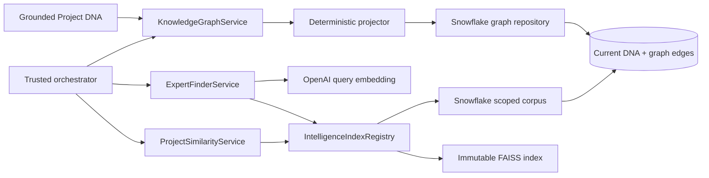

# Phase 6: Organizational intelligence

Phase 6 adds three internal application capabilities: an evidence-backed knowledge
graph, Project DNA similarity, and Expert Finder. It does not add public HTTP routes,
authentication, employee-directory identity resolution, graph visualization, or an
agent workflow. Those boundaries avoid exposing organizational knowledge before an
authorization layer exists.

## Architecture

The implementation is a Clean Architecture bounded context under
`blend_brain.organizational_intelligence`:

- `domain` owns immutable graph, scope, similarity, and expert result models plus
  stable domain errors. It has no infrastructure dependencies.
- `application` owns deterministic graph projection, use-case validation, ports, and
  the authorization-scope index registry.
- `infrastructure` implements Snowflake graph/read repositories, exact FAISS search,
  and the OpenAI query-embedding adapter.
- `bootstrap/intelligence.py` is the composition root. It is the only layer that
  selects concrete adapters and reads settings.

## Knowledge graph

`KnowledgeGraphProjector` converts one evidence-backed Phase 3 `ProjectDNA` into a
versioned graph snapshot without making an additional LLM call. This preserves the
grounding contract and makes projection repeatable, testable, and inexpensive.

Supported nodes are project, client, industry, engagement type, use case, capability,
technology, data source, cloud platform, outcome, differentiator, and expert. Every
edge starts at a project and stores the source DNA ID, claim confidence, and exact
document-section evidence. Entity values are whitespace-normalized and case-folded;
UUIDv5 identifiers make nodes, edges, and projection runs deterministic.

The repository writes a snapshot transactionally:

1. upsert canonical nodes;
2. delete the prior edges for the same DNA version;
3. insert the deterministic replacement edges;
4. upsert the projection audit record;
5. commit, or roll back the complete operation on failure.

Projection is invoked by a trusted orchestration layer after Phase 3 enrichment has
successfully persisted its Project DNA. The current repository has no ingestion worker
or outbox, so automatic event delivery is intentionally not fabricated in this phase.
Retries are safe because the projection is deterministic and replacement is atomic.

### Snowflake tables

- `KNOWLEDGE_GRAPH_NODES` stores canonical typed entities and their normalized keys.
- `KNOWLEDGE_GRAPH_EDGES` stores evidence-backed, version-specific project relations.
- `GRAPH_PROJECTION_RUNS` is the projection version and row-count audit trail.

Migration `004_phase_6_organizational_intelligence.sql` creates these objects. No
clustering key is declared yet. Snowflake recommends evaluating clustering for large,
selective workloads and notes its ongoing compute and storage costs; representative
production query measurements must justify it first. `VECTOR` values are selected as
arrays because Snowflake documents explicit conversion between `VECTOR` and `ARRAY`,
and vector columns cannot be clustering keys.

## Similarity Engine

`ProjectSimilarityService` requires an explicit `IntelligenceScope`; there is no
unscoped search path. The Snowflake read projection retrieves only the allowlisted
projects' current Project DNA vectors and selected graph attributes. FAISS uses an
exact `IndexFlatIP` index over L2-normalized vectors, so its score is cosine similarity.

The source project is excluded. Results below the configured threshold are omitted.
Each result includes shared industries, use cases, capabilities, technologies, and
cloud platforms from the graph so the semantic score has a human-readable explanation.

## Expert Finder

Expert Finder embeds the validated natural-language need in the same model and vector
dimension as Project DNA, then ranks the authorized projects by semantic relevance.
Only experts with an explicit `INVOLVED_EXPERT` graph edge can become candidates.

Ranking combines:

- 80% semantic relevance of the associated Project DNA;
- 20% exact token overlap with graph attributes;
- a small, bounded breadth bonus for evidence across multiple relevant projects.

Every match returns its supporting project IDs, matched graph signals, and original
expert-claim evidence. The score is a discovery ranking, not a calibrated probability
or an assessment of employee availability, proficiency, seniority, or performance.

Expert nodes currently represent normalized names found in project evidence. They are
not verified employee identities: two people with the same name may be merged, and
name variants may remain separate. Production rollout should join a governed HR or
directory identifier through an approved identity-resolution process before experts
are shown as authoritative profiles.

## Authorization and caching

`IntelligenceScope` is a mandatory, normalized project allowlist supplied by a future
trusted authorization layer. Its SHA-256 fingerprint keys a bounded LRU registry of
immutable FAISS indexes. A different allowlist always receives a different index,
preventing cross-scope cache reuse. The orchestrator must call `refresh` or `invalidate`
after knowledge updates that affect a cached scope.

No Phase 6 service is registered as a public route. Adding an API before authenticated
project-level authorization would turn the allowlist into user-controlled input and is
outside the approved security boundary.

## Failure behavior

- Empty or invalid requests fail before infrastructure calls.
- Missing source projects produce a stable `ProjectNotFoundError` without leaking
  whether the project exists outside the caller's scope.
- Empty authorized corpora return no expert matches.
- Invalid, non-finite, zero, or dimension-mismatched vectors are rejected.
- OpenAI response-count or vector-shape violations raise a stable embedding error.
- Snowflake graph writes roll back and raise `GraphPersistenceError`.
- Corpus loading is fail-closed: only current DNA and allowlisted project IDs are read.

## Configuration

All settings use the `BLEND_BRAIN_` prefix:

- `INTELLIGENCE_DEFAULT_SIMILARITY_LIMIT` defaults to `6`.
- `INTELLIGENCE_DEFAULT_EXPERT_LIMIT` defaults to `8`.
- `INTELLIGENCE_MAX_EXPERT_QUERY_CHARACTERS` defaults to `2000`.
- `INTELLIGENCE_MAX_CACHED_SCOPES` defaults to `32`.
- `INTELLIGENCE_MINIMUM_SIMILARITY` defaults to `0.6`.
- `INTELLIGENCE_MINIMUM_EXPERT_SCORE` defaults to `0.55`.

Phase 6 also requires enabled Snowflake configuration and an OpenAI API key. Expert
query embeddings reuse `OPENAI_EMBEDDING_MODEL` and
`OPENAI_EMBEDDING_DIMENSIONS`, which must remain identical to Project DNA embeddings.

## Testing

Unit tests cover graph determinism, entity merging and evidence retention, transaction
commit/rollback, scoped Snowflake reads, exact similarity, expert ranking, cache
isolation and eviction, request validation, embedding response validation, bootstrap
composition, migration constraints, and architectural dependency rules. External
services are replaced with typed fakes; the suite never needs network credentials.

## Acceptance criteria

- A Project DNA version produces the same graph identifiers on every retry.
- Graph edges retain claim confidence and literal source evidence.
- Graph replacement and its audit record are atomic.
- Similar projects are drawn only from the authorized scope and exclude the source.
- Similarity results include graph-derived shared signals.
- Expert candidates have explicit evidence and come only from authorized projects.
- Scope-specific indexes cannot be reused across different allowlists.
- Configuration is validated and all code passes formatting, linting, strict typing,
  architecture, and test gates.

## Future considerations

- Add authenticated, project-authorized API routes and frontend experiences.
- Use an outbox or durable queue to project graph updates after enrichment commits.
- Resolve experts to governed employee-directory IDs and apply consent/privacy rules.
- Add temporal employment, role, proficiency, and availability facts from authoritative
  systems rather than inferring them from documents.
- Evaluate graph-native traversal or Snowflake recursive queries when multi-hop use
  cases are approved; Phase 6 intentionally supports evidence-backed project stars.
- Benchmark approximate vector indexes only after exact search no longer meets latency
  and capacity objectives.
- Add index versioning or event-driven invalidation for horizontally scaled services.
- Measure production Snowflake pruning before selecting search optimization or
  clustering strategies.

References: [Snowflake VECTOR data type](https://docs.snowflake.com/en/sql-reference/data-types-vector)
and [Snowflake clustering keys](https://docs.snowflake.com/en/user-guide/tables-clustering-keys).
