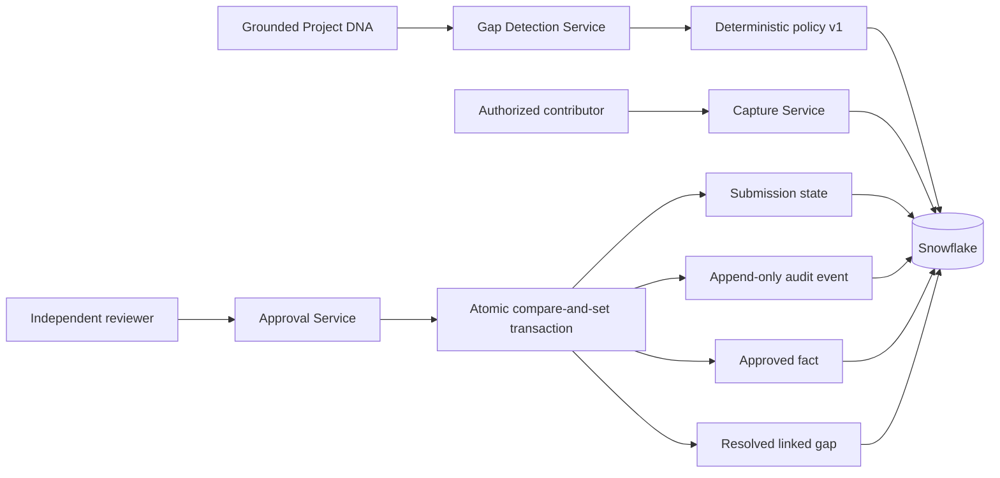
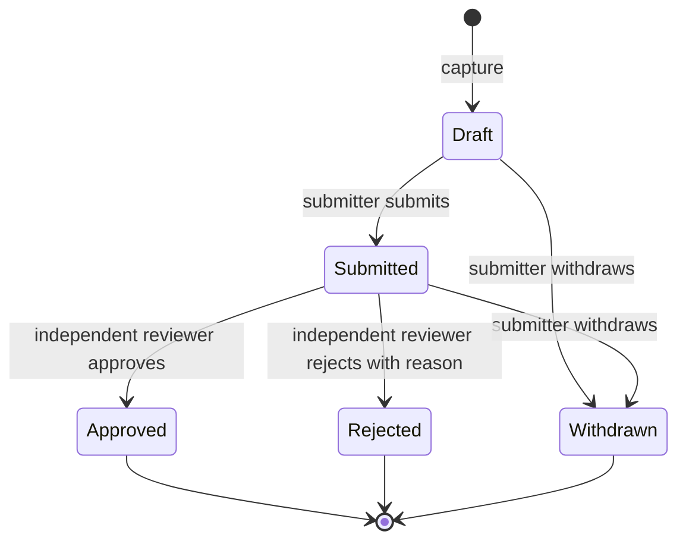

# Phase 7: Governed knowledge lifecycle

Phase 7 detects incomplete Project DNA, captures employee contributions, persists the
complete workflow, and requires independent approval before a contribution becomes an
approved organizational fact. It does not automatically publish approved facts into
Project DNA, retrieval, embeddings, or the knowledge graph.

## Architecture

The implementation is a Clean Architecture bounded context under
`blend_brain.knowledge_lifecycle`:

- `domain` owns gap, actor, scope, submission, audit event, approved-fact, status, and
  stable error models.
- `application` owns deterministic gap policy, capture validation, authorization,
  transition rules, optimistic version checks, and ports.
- `infrastructure` owns Snowflake transactions plus production UTC-clock and UUID
  adapters.
- `bootstrap/knowledge_lifecycle.py` validates settings and composes the concrete
  services for a trusted orchestration layer.

## Knowledge-gap detection

`KnowledgeGapDetector` evaluates the current evidence-backed `ProjectDNA` without an
additional LLM call. Policy version 1 assesses every supported DNA field for:

- `missing`: the scalar claim is absent or the collection is empty;
- `low_confidence`: one or more claims have Phase 3 `low` confidence.

Each field has an explicit missing-data severity. Outcomes are critical; client,
industry, summary, challenges, use cases, capabilities, and experts are high priority;
supporting technical and differentiator fields are medium or low priority. Policy
objects also support a field-specific low-confidence severity.

Assessment, gap, and policy-version identifiers are deterministic UUIDv5 values. The
same DNA and policy therefore produce the same records on every retry. Existing
resolved status is preserved when a matching gap is reassessed.

This policy identifies completeness and evidence-quality gaps. It does not claim that
an absent field is applicable, infer contradictory facts, or evaluate employee
performance. Applicability overrides and cross-document contradiction detection need
separate governed inputs in a later phase.

## Capture workflow

An authenticated actor needs the `knowledge:capture` permission and the project must
belong to the supplied `KnowledgeScope` allowlist. A capture creates a private `draft`
and an immutable `captured` event. Contributions may either address an open detected
gap or proactively supplement a Project DNA field.

When linked to a gap:

- the gap must belong to the same project;
- the submission field must match the gap field;
- resolved gaps reject new submissions.

Values, rationales, source references, withdrawal reasons, and reviewer reasons are
trimmed and bounded before persistence. Content remains untrusted human input and must
be output-encoded by any future UI.

Only the submitter may move a draft to `submitted` or withdraw their own `draft` or
`submitted` contribution. Rejected, approved, and withdrawn submissions are terminal;
corrections require a new contribution so the audit history remains immutable.

## Approval workflow

An authenticated actor needs `knowledge:review`, the project must be in their supplied
scope, and they cannot review their own contribution. Only `submitted` knowledge can
be approved or rejected. Rejection requires a reason.

Every mutable request supplies `expected_version`. The repository updates only when
both the stored status and version match. Concurrent or repeated requests affect zero
rows, roll back, and return a stable workflow-conflict error.

Approval commits four effects in one Snowflake transaction:

1. compare-and-set the submission to `approved`;
2. append the approval audit event;
3. create exactly one approved fact for the submission;
4. resolve the linked open gap, when present.

No partial approval can be committed. The compare-and-set transition prevents a second
fact on retry; the unique submission constraint also documents that schema invariant.

## Snowflake persistence

Migration `005_phase_7_knowledge_lifecycle.sql` creates:

- `KNOWLEDGE_GAP_ASSESSMENTS`: policy-versioned assessment audit records;
- `KNOWLEDGE_GAPS`: detected field deficiencies and resolution linkage;
- `KNOWLEDGE_SUBMISSIONS`: current contribution state and optimistic version;
- `KNOWLEDGE_APPROVAL_EVENTS`: append-only actor and transition audit history;
- `APPROVED_KNOWLEDGE`: reviewer-approved facts with source attribution.

All SQL values are parameter-bound and runtime database/schema identifiers are
allowlist-validated. Connections use explicit transactions, short lifetimes, and the
`blend-knowledge-brain:phase-7` Snowflake query tag. Snowflake errors are translated to
stable safe errors with SQL state and error number, without leaking submitted content.

The migration must run after migrations 003 and 004 because it references projects and
Project DNA. Actor identifiers deliberately reference the external identity provider,
not a local employee table that does not yet exist.

## Publication boundary

`APPROVED_KNOWLEDGE` is governed source material, not generated Project DNA. Phase 7
does not mutate a prior DNA JSON document, manufacture document-section citations, or
reuse stale embeddings. A future publication orchestrator must explicitly:

1. materialize an approved contribution as governed source content;
2. run enrichment and evidence generation;
3. create a new Project DNA version and embeddings;
4. rebuild its knowledge-graph projection;
5. invalidate affected retrieval and intelligence indexes.

This separation ensures draft, rejected, and merely approved text never enters answers
or recommendations through an implicit side channel.

## Authorization boundary

`KnowledgeActor` contains an opaque authenticated actor ID and explicit permissions.
`KnowledgeScope` is an exact project allowlist supplied by a future trusted policy
enforcement layer. Services require both permission and scope; repository reads also
bind project ID with opaque record ID to avoid cross-project lookup disclosure.

No public Phase 7 HTTP routes are registered. Authentication, project authorization,
reviewer assignment, and identity-provider integration must exist before exposing
capture or approval actions externally.

## Configuration

All settings use the `BLEND_BRAIN_` prefix:

- `KNOWLEDGE_MAX_VALUE_CHARACTERS` defaults to `20000`;
- `KNOWLEDGE_MAX_RATIONALE_CHARACTERS` defaults to `4000`;
- `KNOWLEDGE_MAX_SOURCE_REFERENCE_CHARACTERS` defaults to `4000`.

Phase 7 requires enabled, complete Snowflake configuration. It does not require an
OpenAI API key because detection and governance are deterministic.

## Failure behavior

- Invalid or oversized capture data fails before persistence.
- Missing permission or project scope returns a stable authorization error.
- Scoped missing gaps/submissions return the same safe not-found error.
- Invalid state, self-review, resolved-gap capture, or stale version returns a workflow
  conflict or authorization error without changing data.
- Corrupt Snowflake rows fail closed instead of being partially mapped.
- Every write rolls back completely on Snowflake or optimistic-lock failure.

## Testing

Tests cover deterministic detection, field priorities, low-confidence gaps, invalid
policies, capture limits, scope and permission enforcement, gap linkage, ownership,
self-review prevention, submit/withdraw/approve/reject transitions, mandatory rejection
reasons, optimistic conflicts, approved-fact creation, gap resolution, Snowflake
commit/rollback, query mapping, migration constraints, composition, strict typing, and
architectural dependency rules. External services use typed fakes and require no
credentials.

## Acceptance criteria

- Gap detection is deterministic, versioned, and does not invent knowledge.
- Every capture and transition produces an immutable actor audit event.
- Contributions cannot cross their authorized project scope.
- Only submitters can submit or withdraw their contributions.
- Reviewers cannot approve or reject their own contributions.
- Approval and gap resolution are atomic and concurrency-safe.
- Only approved submissions create governed facts.
- Approved facts remain outside retrieval until explicit republication.
- Formatting, linting, strict typing, architecture, migration, and test gates pass.

## Future considerations

- Add authenticated APIs, reviewer queues, notifications, and frontend experiences.
- Integrate IdP groups, reviewer assignment, delegation, and separation-of-duties rules.
- Add applicability decisions so intentionally absent DNA fields can be dismissed with
  an audited rationale.
- Detect contradictions and staleness across multiple current governed sources.
- Add data-classification, PII review, legal hold, retention, and redaction policies.
- Build the explicit approved-fact publication pipeline and transactional outbox.
- Add reviewer service-level objectives, escalation, and audit reporting.
- Consider multi-reviewer or risk-tiered approval for sensitive fields.
