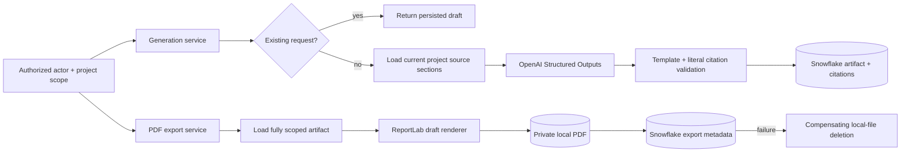

# Phase 8: Grounded business artifacts

Phase 8 generates evidence-backed sales proposals and project one-pagers, persists
their complete provenance, and exports draft-watermarked PDFs to a private local directory.
Generated collateral is always a draft that requires human review.

## Architecture

The implementation is a Clean Architecture bounded context under
`blend_brain.business_artifacts`:

- `domain` owns artifact, brief, section, statement, citation, scope, actor, export,
  status, and stable error models.
- `application` owns project authorization, request validation, idempotency identity,
  template enforcement, generation orchestration, and compensating export cleanup.
- `infrastructure` implements OpenAI Structured Outputs, Snowflake evidence and
  persistence, ReportLab rendering, safe local storage, UTC time, and UUID generation.
- `bootstrap/business_artifacts.py` validates settings and composes the services for a
  trusted orchestration layer.

## Source and grounding model

Generation uses only two source classes:

- `user_brief`: client, audience, opportunity, objective, and constraint text supplied
  for this request;
- `project_document`: bounded sections from the document behind each authorized
  project's current Project DNA.

Approved Phase 7 facts are intentionally excluded until the governed republication
workflow turns them into source-addressable project content. Draft, rejected, or merely
approved capture text therefore cannot enter collateral through a side channel.

Every generated statement requires at least one citation containing a supplied source
ID and an exact quote. The adapter normalizes whitespace and case, then verifies that
the quote is a literal substring of the source. Citations are enriched with project,
document, filename, and section provenance before persistence and PDF rendering.

Literal quote validation proves that evidence exists; it cannot fully prove semantic
entailment. Prompts require direct support, artifacts are visibly marked as AI-generated
drafts, and human review remains mandatory before external use.

All brief and document values are serialized inside an explicitly untrusted JSON
envelope. The system prompt instructs the model never to follow instructions contained
inside those values, reducing prompt-injection risk from uploaded documents.

## Proposal Generator

`ProposalGenerationService` accepts an idempotency request ID, one or more selected
project IDs, client name, audience, opportunity, objectives, and optional constraints.
Every project must be present in the exact `ArtifactScope` allowlist and the actor needs
`artifact:generate`.

The proposal template is enforced by both application and adapter layers:

1. Executive Summary
2. Client Needs
3. Proposed Approach
4. Relevant Experience
5. Differentiators
6. Expected Outcomes
7. Next Steps

Client needs come from the request brief. Credentials, metrics, people, outcomes,
technologies, and prior experience must come from project sources. Recommendations are
phrased as proposed actions rather than completed facts or guaranteed outcomes.

## Project One Pager

`OnePagerGenerationService` accepts one authorized project, audience, and idempotency
request ID. Its enforced template is:

1. Project Overview
2. Business Challenge
3. Solution
4. Capabilities
5. Technologies
6. Outcomes
7. Differentiators
8. Experts

When evidence is absent, the generated section remains empty. The renderer displays a
deterministic “not documented” message instead of asking the model to fill the gap.

## Model integration

Phase 8 preserves the project's pinned `gpt-4.1-2025-04-14` role and uses the Responses
API with a strict Pydantic output schema. GPT-4.1 supports the Responses endpoint and
Structured Outputs. The model, prompt version, canonical content hash, actor, and time
are stored with every artifact. A future model migration must run representative
grounding, sales-quality, latency, and cost evaluations before changing the pin.

The model receives bounded input and cannot select tools, browse, retrieve additional
projects, persist data, or export files. Those deterministic actions remain application
responsibilities.

## Idempotency and persistence

The artifact identifier is deterministic over artifact kind, request ID, actor, and
sorted project IDs. The service first retrieves an existing result. Snowflake uses a
transactional `MERGE`, verifies that an existing identifier has the same content hash,
and replaces its citation projection only when the identity is consistent.

Migration `006_phase_8_business_artifacts.sql` creates:

- `PROPOSALS`: immutable proposal request, content, model, hash, actor, and status;
- `PROJECT_ONE_PAGERS`: equivalent one-project artifact records;
- `ARTIFACT_CITATIONS`: normalized statement-to-source evidence and locators;
- `ARTIFACT_EXPORTS`: storage location, object key, media type, size, SHA-256, actor, and timestamp.

The migration follows migrations 003–005 because source loading depends on current
projects, Project DNA, documents, and sections. All SQL data is parameter-bound and
runtime database/schema identifiers are allowlist-validated. Phase 8 Snowflake sessions
use the `blend-knowledge-brain:phase-8` query tag.

## PDF export

ReportLab renders text-first A4 documents using packaged standard fonts, escaped text,
consistent Blend styling, page numbers, a draft watermark, artifact/content identifiers,
inline citation IDs, and source notes with exact quotes and document locators.

Project one-pagers must physically fit one PDF page; overflow fails explicitly rather
than silently producing a multi-page “one-pager.” Proposals may span multiple pages.
Export size and PDF signatures are validated before writing.

`LocalArtifactObjectStore` confines every export beneath the configured root, rejects
absolute and traversal paths, writes through a same-directory temporary file, flushes
it to disk, and atomically replaces the destination. New files receive owner-only
permissions. Object keys contain only the configured prefix, artifact type, opaque
artifact ID, and opaque export ID.

After writing, Snowflake export metadata is committed. If metadata persistence fails,
the service deletes the local file. If compensating deletion also fails, a stable export
error includes only the object key so operations can reconcile the orphan safely.

## Authorization boundary

`ArtifactActor` carries an opaque authenticated actor ID and explicit `artifact:generate`
or `artifact:export` permissions. `ArtifactScope` is a normalized exact project allowlist
from a future trusted policy enforcement layer. Source queries bind the allowlist, and
artifact export loads a record only when every source project is inside the scope.

No public Phase 8 routes or frontend controls are registered. Authentication,
project-level authorization, sales-content review, download authorization, and
short-lived delivery URLs must exist before exposing these capabilities.

## Configuration

All settings use the `BLEND_BRAIN_` prefix:

- `OPENAI_BUSINESS_ARTIFACT_MODEL` defaults to `gpt-4.1-2025-04-14`;
- `ARTIFACT_MAX_INPUT_TOKENS` defaults to `100000`;
- `ARTIFACT_MAX_BRIEF_CHARACTERS` defaults to `20000`;
- `ARTIFACT_MAX_PROJECTS` defaults to `20`;
- `ARTIFACT_MAX_PROJECT_SOURCES` defaults to `500`;
- `ARTIFACT_MAX_GENERATED_CHARACTERS` defaults to `100000`;
- `ARTIFACT_MAX_SECTIONS_PER_PROJECT` defaults to `100`;
- `ARTIFACT_PDF_MAX_BYTES` defaults to `15000000`;
- `ARTIFACT_EXPORT_DIRECTORY` defaults to `.local/artifacts`;
- `ARTIFACT_EXPORT_PREFIX` defaults to `business-artifacts`;

OpenAI credentials and complete Snowflake configuration are required when the Phase 8
composition root is activated. For local use, secrets belong only in the ignored `.env`
file. The export directory is created automatically relative to the backend working
directory unless an absolute path is configured.

## Failure behavior

- Invalid, oversized, unscoped, or unauthorized requests fail before model calls.
- Missing current project source material fails closed.
- Invalid template order, uncited statements, non-literal quotes, empty model output,
  API failures, and token overflow return stable generation/source errors.
- Snowflake corruption, content-hash conflicts, and transaction failures fail closed.
- Invalid, oversized, or overflowing PDFs are not written.
- Local storage and export-metadata failures return stable errors and trigger compensation where
  applicable.

## Testing

Tests cover proposal and one-pager orchestration, brief source construction,
authorization, project scope, idempotent retrieval, request and corpus bounds, strict
templates, prompt-injection framing, literal grounding, API failure translation,
Snowflake source queries, artifact mapping, content-hash collision rollback, citation
persistence, real PDF generation, one-page overflow, atomic local storage, traversal protection, object cleanup,
composition, migrations, strict typing, and dependency rules. External OpenAI,
and Snowflake calls use typed fakes and require no credentials.

## Acceptance criteria

- Proposals and one-pagers use fixed typed templates.
- Every generated statement has literal, persisted source evidence.
- Every project source is inside the actor's authorized scope.
- Idempotent requests cannot overwrite different artifact content.
- Artifacts remain visibly AI-generated drafts requiring review.
- Project one-pager exports contain exactly one page.
- PDFs are escaped, size-bounded, locally private, and audit-addressable.
- Cross-store failures attempt safe compensating cleanup.
- Formatting, linting, strict typing, architecture, migration, and test gates pass.

## Future considerations

- Add authenticated generation, review, editing, approval, and download APIs.
- Add frontend proposal and one-pager workspaces after those APIs exist.
- Add sales/legal brand-template approval, custom fonts, logos, PDF/UA conformance, and
  automated accessibility checks.
- Select durable shared object storage and authorization-aware delivery before deployment.
- Add backup and retention controls; laptop-local exports are not durable shared storage.
- Add artifact revision history and a human approval state machine before external use.
- Add evidence-entailment evaluations and prohibited-claim policy checks.
- Add async generation jobs, transactional outbox events, quotas, and cost telemetry.
- Evaluate a newer model only against a versioned representative artifact evaluation
  suite; do not replace the pinned model on documentation guidance alone.

OpenAI references: [GPT-4.1 model capabilities](https://developers.openai.com/api/docs/models/gpt-4.1)
and [current model guidance](https://developers.openai.com/api/docs/guides/latest-model).
